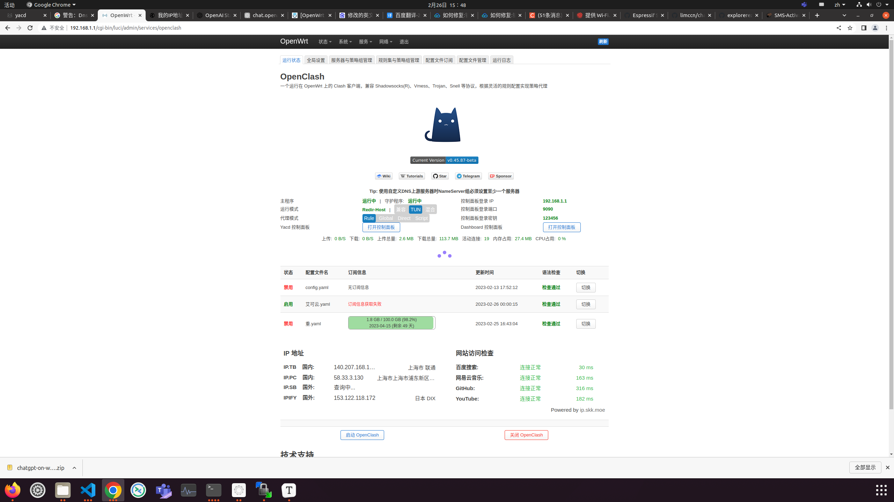
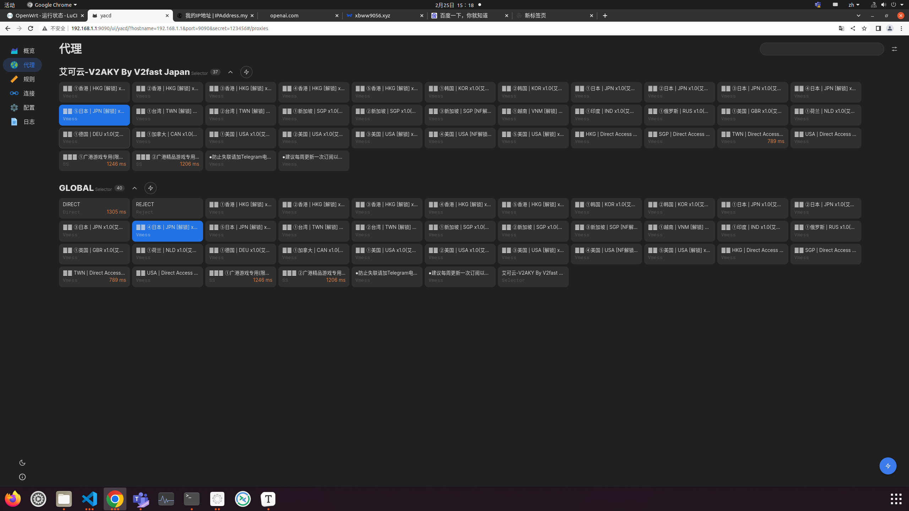

# 快速开始

## 准备

### 1. OpenAI账号注册

#### (1)接入OpenWrt路由器（有线无线均可），进入192.168.1.1 OpenWrt管理页面

#### 顶端 `服务` -> `OpenClash`

进入如下界面，如看到IP地址为日本、美国 且四个网址都正常连接即可访问 ChatGPT  网页()

 

> OpenWrt搭建的梯子可能会卡慢，多刷新几次

#### 如果还不可以访问，点击页面上的Yacd控制面板切换节点



#### (2) 访问ChatGPT开始注册

> [ChatGPT登录](https://chat.openai.com/auth/login)

点击 Sign up 根据提示进行创建一个 OpenAI 账号；输入你的电子邮箱继续。如果你有 Gmail，你也可以点击下方的 Continue with Google 按钮直接以 Google 账号注册。

到达输入电话号的界面时，进入以下网页

> 在[虚拟号码平台](https://sms-activate.org/?ref=2730606)中获取账号绑定的外国手机号（国内手机号不可以用）

点击左侧的 OpenAI 服务，如下图


> 
>
> 2.15日更新：推荐购买马来西亚、美国号码，成功率高，其他国家号码可能会失败
>
> 

购买后，页面内会出现电话号码

在OpenAI注册框中输入号码发送验证码并填写验证码完成注册即可


#### 注意 》》ChatGPT  web端在完成登录状态后即可接回原来的网络中，照常可以使用，但请不要清除缓存、cookie，以保持登录状态。


> ChatGPT项目API中调用的对话模型是 davinci，API的NLP能力大大不如WEB端的能力，包括但不限于，自然语言生成能力、信息准确性、信息价值等。计费方式是约每 750 字 (包含请求和回复) 消耗 $0.02，图片生成是每张消耗 $0.016，账号创建有免费的 $18 额度，使用完可以更换邮箱重新注册。

#### (3) API key 获取

创建完账号则前往 [API管理页面](https://beta.openai.com/account/api-keys) 创建一个 API Key 并保存下来，后面需要在项目中配置这个key。


### 2.运行环境

支持 Linux、MacOS、Windows 系统（可在Linux服务器上长期运行)，同时需安装 `Python`。 
> 建议Python版本在 3.7.1~3.9.X 之间，3.10及以上版本在 MacOS 可用，其他系统上不确定能否正常运行。

1.克隆项目代码：

```bash
git clone https://github.com/zhayujie/chatgpt-on-wechat
cd chatgpt-on-wechat/
```

2.安装所需核心依赖：

```bash
pip3 install itchat-uos==1.5.0.dev0
pip3 install --upgrade openai
```
注：`itchat-uos`使用指定版本1.5.0.dev0，`openai`使用最新版本，需高于0.25.0。


## 配置

配置文件的模板在根目录的`config-template.json`中，需复制该模板创建最终生效的 `config.json` 文件：

```bash
cp config-template.json config.json
```

然后在`config.json`中填入配置，以下是对默认配置的说明，可根据需要进行自定义修改：

```bash
# config.json文件内容示例
{ 
  "open_ai_api_key": "YOUR API KEY",                          # 填入上面创建的 OpenAI API KEY
  "single_chat_prefix": ["bot", "@bot"],                      # 私聊时文本需要包含该前缀才能触发机器人回复
  "single_chat_reply_prefix": "[bot] ",                       # 私聊时自动回复的前缀，用于区分真人
  "group_chat_prefix": ["@bot"],                              # 群聊时包含该前缀则会触发机器人回复
  "group_name_white_list": ["ChatGPT测试群", "ChatGPT测试群2"], # 开启自动回复的群名称列表
  "image_create_prefix": ["画", "看", "找"],                   # 开启图片回复的前缀
  "conversation_max_tokens": 1000,                            # 支持上下文记忆的最多字符数
  "character_desc": "你是ChatGPT, 一个由OpenAI训练的大型语言模型, 你旨在回答并解决人们的任何问题，并且可以使用多种语言与人交流。"  # 人格描述
}
```
**配置说明：**

**1.个人聊天**

+ 个人聊天中，需要以 "bot"或"@bot" 为开头的内容触发机器人，对应配置项 `single_chat_prefix` (如果不需要以前缀触发可以填写  `"single_chat_prefix": [""]`)
+ 机器人回复的内容会以 "[bot] " 作为前缀， 以区分真人，对应的配置项为 `single_chat_reply_prefix` (如果不需要前缀可以填写 `"single_chat_reply_prefix": ""`)

**2.群组聊天**

+ 群组聊天中，群名称需配置在 `group_name_white_list ` 中才能开启群聊自动回复。如果想对所有群聊生效，可以直接填写 `"group_name_white_list": ["ALL_GROUP"]`
+ 默认只要被人 @ 就会触发机器人自动回复；另外群聊天中只要检测到以 "@bot" 开头的内容，同样会自动回复（方便自己触发），这对应配置项 `group_chat_prefix`
+ 可选配置: `group_name_keyword_white_list`配置项支持模糊匹配群名称，`group_chat_keyword`配置项则支持模糊匹配群消息内容，用法与上述两个配置项相同。

**3.其他配置**

+ 对于图像生成，在满足个人或群组触发条件外，还需要额外的关键词前缀来触发，对应配置 `image_create_prefix `
+ 关于OpenAI对话及图片接口的参数配置（内容自由度、回复字数限制、图片大小等），可以参考 [对话接口](https://beta.openai.com/docs/api-reference/completions) 和 [图像接口](https://beta.openai.com/docs/api-reference/completions)  文档直接在 [代码](https://github.com/explorerezral/chat-bot/blob/master/bot/openai/open_ai_bot.py) `bot/openai/open_ai_bot.py` 中进行调整。
+ `conversation_max_tokens`：表示能够记忆的上下文最大字数（一问一答为一组对话，如果累积的对话字数超出限制，就会优先移除最早的一组对话）
+ `character_desc` 配置中保存着你对机器人说的一段话，他会记住这段话并作为他的设定，你可以为他定制任何人格      


## 运行

### 1.本地运行

如果是开发机 **本地运行**，直接在项目根目录下执行：

```bash
python3 app.py
```
终端输出二维码后，使用微信进行扫码，当输出 "Start auto replying" 时表示自动回复程序已经成功运行了（注意：用于登录的微信需要在支付处已完成实名认证）。扫码登录后你的账号就成为机器人了，可以在微信手机端通过配置的关键词触发自动回复 (任意好友发送消息给你，或是自己发消息给好友)，参考[#142](https://github.com/zhayujie/chatgpt-on-wechat/issues/142)。 


### 2.服务器部署

使用nohup命令在后台运行程序：

```bash
touch nohup.out                                   # 首次运行需要新建日志文件                     
nohup python3 app.py & tail -f nohup.out          # 在后台运行程序并通过日志输出二维码
```
扫码登录后程序即可运行于服务器后台，此时可通过 `ctrl+c` 关闭日志，不会影响后台程序的运行。

使用 `ps -ef | grep app.py | grep -v grep` 命令可查看运行于后台的进程，如果想要重新启动程序可以先 `kill` 掉对应的进程。

日志关闭后如果想要再次打开只需输入 `tail -f nohup.out`。

> **注意：** 如果 扫码后手机提示登录验证需要等待5s，而终端的二维码再次刷新并提示 `Log in time out, reloading QR code`，此时需参考此 [issue](https://github.com/zhayujie/chatgpt-on-wechat/issues/8) 修改一行代码即可解决。

> **多账号支持：** 将 项目复制多份，分别启动程序，用不同账号扫码登录即可实现同时运行。

> **特殊指令：** 用户向机器人发送 **#清除记忆** 即可清空该用户的上下文记忆。

 
